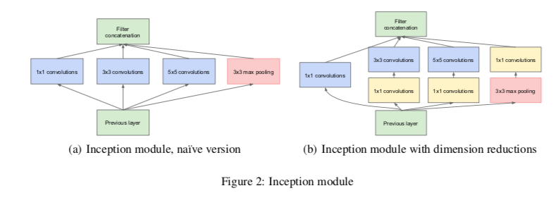
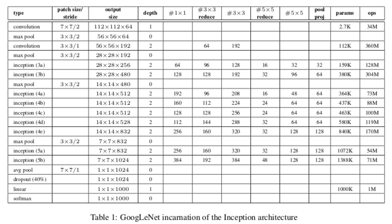

# GoogLeNet

这是一个基于TensorFlow多GPU的方式实现[GoogLeNet](http://arxiv.org/abs/1409.4842)的项目，数据集采用[mini-imagenet](https://github.com/y2l/mini-imagenet-tools#about-mini-ImageNet)，数据读取方式采用`tf.data.Dataset`API，直接从磁盘读取图片和对应对应的label，不需要将其转化为`TFRecord`

## Introduction

- Inception module

  

- Inception architure

## Requirements

- TensorFlow 1.9
- Python3.6

## Implement Details

- 使用`tf.data.Dataset`API构建输入数据的Pipeline，但是目前有个问题，每迭代完一个epoch，都要重新读取一次数据（尤其是shuffle阶段，如下图所示），这点有点耗时间，可能是我代码写的有点问题，目前没有解决

  

- 使用多GPU的方式进行训练，这里使用的是两个1080Ti

## Dataset

- 采用的数据集为网上整理的[mini-imagenet](https://github.com/y2l/mini-imagenet-tools#about-mini-ImageNet)，总共有100个类，60000张图片，原作者将其划分为训练集、验证集、测试集用于few_shot学习，这里使用sklearn重新划分为训练集和测试集，比例为7:3
- 由于目前GitHub上关于图像分类的例子基本都是基于已经预处理好的或者特殊格式的数据集，不利于学习
- 目前大多数的教程对数据集的读取都是将其转化为TFRecord形式，再去读取，这样对于大规模数据集来说很不现实，这样会额外占用很大的空间

## Usage 

- `python  train.py`
- 目前测试代码不是很完善，后续更新

## Result

### Loss and accuracy

- ax1_loss on gpu_0

- ax1_loss on gpu_1

- ax2_loss on gpu_0

  

- ax2_loss on gpu_1

  

  

- main_loss on gpu_0

  

- main_loss on gpu_1

  

- train accuracy

  

### Graph

## Reference

- https://zhuanlan.zhihu.com/p/30751039
- https://github.com/y2l/mini-imagenet-tools
- https://github.com/wangtianrui/TfDatasetApiTest/blob/master/DataSetApiTest.py
- https://github.com/aymericdamien/TensorFlow-Examples

- https://github.com/taki0112/Self-Attention-GAN-Tensorflow/blob/master/SAGAN.py
- https://github.com/auroua/InsightFace_TF/blob/master/train_nets_mgpu_new.py